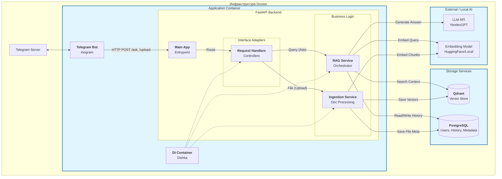
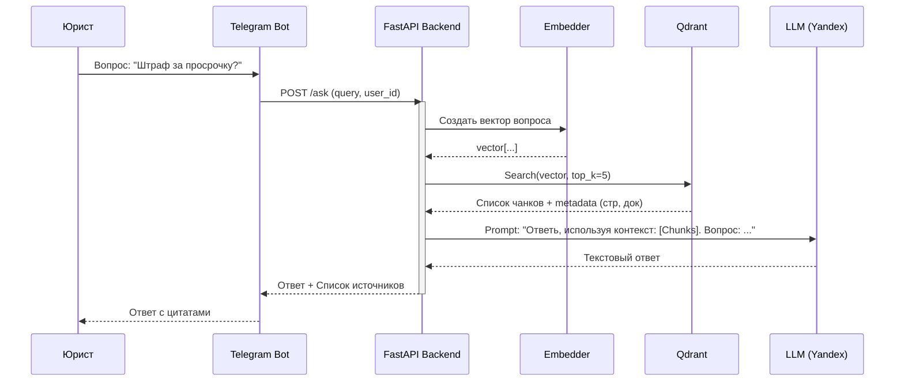
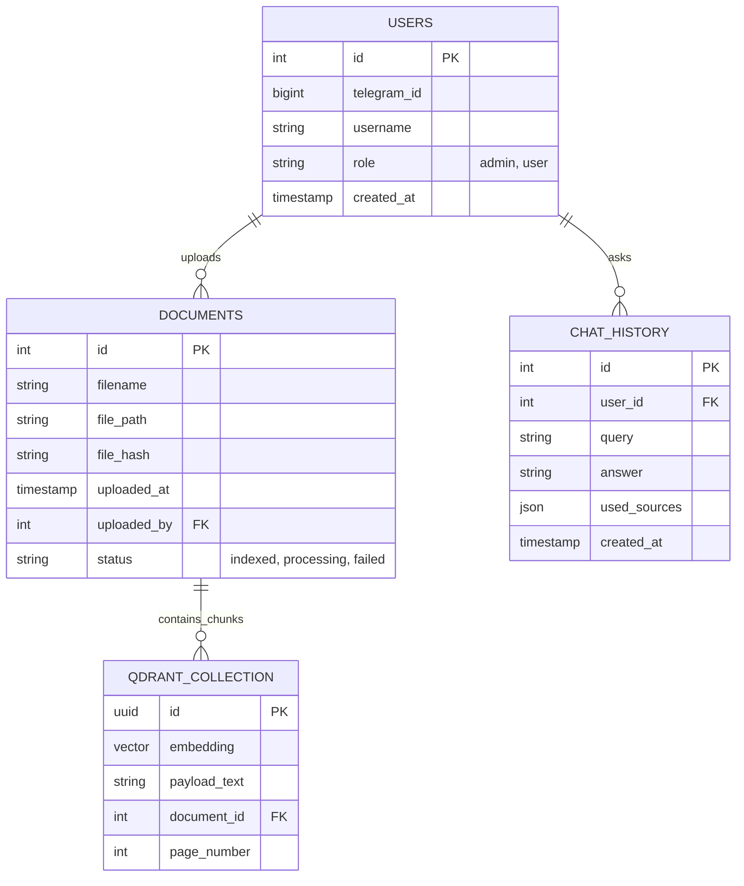

# hse-python-advanced-project

# Проект: AI-ассистент для юристов (Legal RAG Bot)

## 1. Описание продукта

**Legal RAG Bot** — это интеллектуальная диалоговая система для юристов и компаний, который использует технологию RAG для быстрого поиска и анализа внутренней базы знаний (документов, законов, прецедентов) и предоставления точных, обоснованных ответов на естественном языке. Система использует технологию RAG (Retrieval-Augmented Generation) для поиска релевантных фрагментов текста и генерации обоснованных ответов с обязательным указанием источников (название документа, номер страницы/статьи).

### 1.1. Проблема

Юристы тратят огромное количество рабочего времени на поиск информации в огромных массивах неструктурированных данных (PDF-сканы, DOCX, текстовые файлы).
Основные боли:
- Сложность поиска по смыслу, а не по ключевым словам.
- Необходимость перечитывать многостраничные документы ради одного факта.
- Риск галлюцинаций обычных LLM (без RAG) при работе с законами — они могут выдумавать статьи и факты.
- Отсутствие ссылок на источник в стандартных AI-решениях.

### 1.2. Идея и цель

Создать сервис, который выступает в роли помощника юриста: быстро находит информацию, анализирует её и выдает ответ, подтвержденный ссылками на источники.

**Ключевые особенности:**
- **RAG (Retrieval-Augmented Generation):** Ответ формируется только на основе документов из базы данных, а не выдумывается из головы.
- **Мультимодальность:** Поддержка PDF, DOCX, изображений (через Docling).
- **Гибкость:** Возможность переключения режимов (Анализ, Составление, Общие вопросы).
- **Безопасность:** Работа в контуре компании (Docker), возможность использования локальных LLM.

---

## 2. Что видит пользователь

Пользователь взаимодействует с системой через Telegram-бота.

### 2.1. Сценарии использования (Use Cases)

#### Сценарий 1: Поиск и консультация
1. Пользователь пишет вопрос: *"Какая ответственность предусмотрена за нарушение сроков поставки в договоре с ООО 'Ромашка'?"*.
2. Бот отправляет статус: *"Изучаю базу знаний..."*.
3. Система находит релевантные чанки в Qdrant, ранжирует их и скармливает LLM.
4. Бот присылает ответ:
   > "Согласно пункту 5.2 Договора поставки №123, ответственность составляет 0.1% от суммы за каждый день просрочки.
   >
   > **Источники:**
   > 1. *Договор_Ромашка_2023.pdf* (стр. 5)
   > 2. *Доп_соглашение_1.docx* (стр. 1)"

#### Сценарий 2: Загрузка документов (Администратор/Юрист)
1. Пользователь отправляет PDF-файл или архив.
2. Система ставит файлы в очередь на обработку (Docling -> Chunking -> Embedding -> Qdrant).
3. Пользователь получает уведомление: *"Документы проиндексированы и доступны для поиска"*.

#### Сценарий 3: Выбор режима работы
1. Команда `/mode` или меню.
2. Выбор:
   - **Поиск фактов** (строго по базе).
   - **Генерация** (составь претензию/документ/завещание на основе найденного).

---

## 3. Архитектура и технологии

Проект будет построен на принципах микросервисной архитектуры, упакованной в Docker/Docker Compose.

### 3.1. Технологический стек
- **Язык:** Python
- **Telegram Bot:** `aiogram` (асинхронность, FSM, фильтры).
- **Backend API:** `FastAPI` (предоставляет REST API для бота и управляет бизнес-логикой).
- **Vector DB:** `Qdrant` (хранение эмбеддингов документов и метаданных).
- **Relational DB:** `PostgreSQL` (хранение пользователей, истории запросов, мета-информации о файлах).
- **ORM:** `SQLAlchemy` (асинхронная работа с БД).
- **ML/LLM:**
  - `LangChain` (оркестрация RAG).
  - `YandexGPT API` (основная генерация).
  - Локальные модели (HuggingFace/Ollama) — как опция для тестов.
  - `Docling` (парсинг документов с таблицами и изображениями).
- **Infrastructure:** `Docker`, `Docker Compose`.

### 3.2. Архитектура системы (Mermaid)

Диаграмма компонентов и потоков данных.



### 3.3. Схема RAG-процесса (Sequence Diagram)

Как происходит обработка вопроса юриста.



---

## 4. Структура базы данных

### 4.1. ER-диаграмма (PostgreSQL + Qdrant Concept)


---

## 5. Организация кода (Project Structure)

```text
src/
├── bot/                 # Адаптер: Telegram Bot (aiogram)
│   ├── handlers/        # Обработчики команд
│   ├── keyboards/       # Кнопки
│   └── middlewares/     # Логирование, аутентификация
├── web/                 # Адаптер: REST API (FastAPI)
│   └── routes/          # Эндпоинты
├── core/                # Ядро приложения
│   ├── domain/          # Сущности (User, Document, SearchResult)
│   ├── services/        # Бизнес-логика (RAGService, IngestionService)
│   └── interfaces/      # Абстрактные интерфейсы (ILLMProvider, IVectorDB)
├── infra/               # Инфраструктура и реализации интерфейсов
│   ├── db/              # SQLAlchemy модели и репозитории
│   ├── vector/          # Клиент Qdrant
│   ├── llm/             # Клиенты YandexGPT/Local
│   ├── parser/          # Логика Docling / Text splitters
│   └── di/              # Конфигурация Dishka (IOC контейнер)
├── migrations/          # Alembic миграции
├── config.py            # Настройки (pydantic settings)
└── main.py              # Точка входа
```

---

## 6. План разработки и распределение ролей

Команда: **3 человека**.
Сроки этапа реализации (MVP): **~3 недели**.

### 6.1. Роли в команде

| Участник | Роль | Зона ответственности |
| :--- | :--- | :--- |
| **Никита** | **TeamLead, ML Engineer** | **Архитектура & RAG Core.**<br>- Проектирование пайплайна RAG.<br>- Настройка Qdrant.<br>- Промпт-инжиниринг (системные промпты для юр. контекста).<br>- Интеграция LLM API.<br>- Code Review. |
| **Илья** | **ML Engineer** | **Data Processing & Research.**<br>- Реализация парсинга документов (Docling, PDF/Image handling).<br>- Логика чанкинга (разбиение текста).<br>- Подбор и тестирование эмбеддинг-моделей.<br>- Эксперименты с локальными LLM (опционально). |
| **Артем** | **Backend / Infra** | **Service & Infrastructure.**<br>- Разработка FastAPI бэкенда.<br>- Настройка Docker / Docker Compose.<br>- Реализация Telegram бота (Aiogram).<br>- Работа с PostgreSQL и SQLAlchemy.<br>- Интеграция Dishka. |

### 6.2. Задачи и оценка времени

#### Этап 1: Настройка и База (Неделя 1)
- **Артем:**
  - [ ] Инициализация репозитория, настройка линтеров. (2ч)
  - [ ] Docker Compose (Postgres, Qdrant). (3ч)
  - [ ] База данных: схемы SQLAlchemy + Alembic. (4ч)
  - [ ] Каркас приложения на FastAPI + Dishka. (5ч)
- **Никита:**
  - [ ] Исследование API YandexGPT. (3ч)
  - [ ] Поднятие локального Qdrant и тесты записи/чтения. (4ч)
- **Илья:**
  - [ ] Сбор датасета тестовых документов. (3ч)
  - [ ] Тесты библиотеки Docling на сложных PDF. (5ч)

#### Этап 2: Core Logic & ML (Неделя 2)
- **Илья:**
  - [ ] Реализация сервиса Ingestion (PDF -> Text -> Chunks). (8ч)
  - [ ] Написание скрипта для индексации базы. (4ч)
- **Никита:**
  - [ ] Реализация RAG-сервиса (Search -> Prompt -> Generate). (ч)
  - [ ] Работа с цитированием источников в промпте. (5ч)
- **Артем:**
  - [ ] Хендлеры бота (Upload, Query, Start). (6ч)
  - [ ] Связка бота с FastAPI через DI. (4ч)

#### Этап 3: Интеграция и Полировка (Неделя 3)
- **Все вместе:**
  - [ ] Интеграционное тестирование.
  - [ ] Доработка форматов ответов (Markdown разметка ссылок).
  - [ ] Написание документации по запуску.
